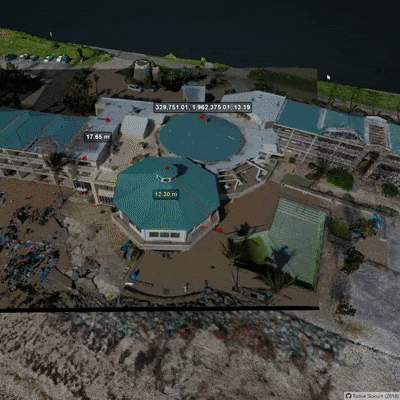

# hokiespurs.github.io
|  |  |
|---|---|
|  | <h1>Buck Island Orthophoto</h1> Map of Buck Island, USVI from a series of UAS mapping missions with the DJI Mavic Pro. |
|  | <h1>Potree SfM</h1>  3D visualization of SfM pointcloud data with image data overlaid as pyramids. |
|  | <h1>UAS Footprint</h1>  Interactive site to visualize and assess UAS footprint sizes. |
|  | <h1>uGigapixel</h1>   CNC based gigapixel image of a painting. |
|  | <h1>Storm Surge Map</h1>  Map of storm surge runup following hurricanes Maria and Irma in 2017 on the USVI. |
|  | <h1>Learnbook</h1>  Informal LaTeX document describing engineering concepts. |
|  | <h1>D3 Contour Map</h1>  Example D3 visualization of the contours of Mt Hood, Oregon. |
|  | <h1>Airport Map</h1>  Interactive map showing the location and airports in the United States. |
|  | <h1>Matlab Scripts</h1>  General purpose matlab scripts that are used across various projects. |
